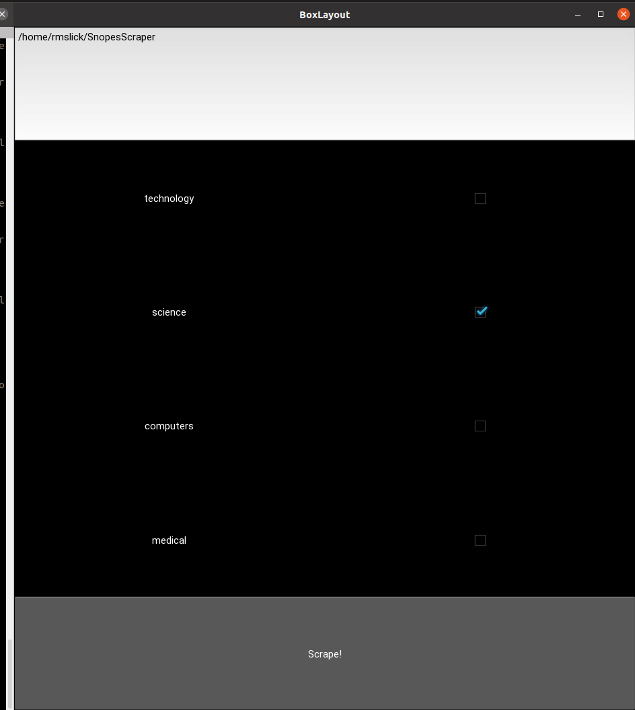

# SnopesScraper

SnopesScraper is a python web scraping tool to extract archived snopes [articles by category](https://www.snopes.com/sitemap/). For each category, every [truth value](https://www.snopes.com/fact-check-ratings/) will get its own json file, Format of the json file is category_truthvalue.json. See science_true.json and science_false.json for examples.

## Usage

1. Run python SnopesScraper.py
2. Enter the filepath at which you want the json data for the selected categories saved
3. Select categories you wish to scrape

## Usage Notes

1. This program is a prototype. The selection of possible categories is hardcoded. The full list can be obtained programatically upon start up if desired.
2. The program will obtain every default page assosciated with every selected category. If desired, an option to specify total number of docs (not to exceed total docs in category on snopes) can be specified.
3. The truth values are hard coded to true/false for testing purposes. Thus if an article has a 'mostly true' rating, for example, it will not be scraped. Adding in the remaining snopes truth values is trivial. 

## Dependencies
1. kivy
2. bs4
3. BeautifulSoup